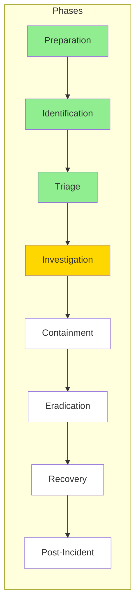

# IR-ASSIST Incident Response Playbook

## Document Information
| Field | Value |
|-------|-------|
| Version | 1.0 |
| Last Updated | February 2026 |
| Classification | Internal Use |
| Owner | [PLACEHOLDER: Insert owner] |

---

## Overview

This playbook provides standardized procedures for responding to cybersecurity incidents. It is designed for use with IR-ASSIST and optimized for banking environments with enterprise-scale infrastructure including datacenters, retail branches, cloud platforms, ATMs, and extensive endpoint environments.

### Core Principle

> **"Too fast for humans, too consequential for machines."**
> 
> IR-ASSIST handles velocity (rapid information processing, pattern matching, playbook execution).
> Humans handle judgment (strategic decisions, novel situations, stakeholder tradeoffs).

### When to Use This Playbook

Use this playbook for incidents involving:
- Confirmed malicious cyber activity
- Lateral movement, credential access, or data exfiltration
- Network intrusions involving multiple systems or users
- Compromised administrator or privileged accounts
- Any incident where major impact has not been ruled out

This playbook does **NOT** apply to:
- Routine security events (single phishing click with no compromise)
- Accidental data spills with no malicious actor
- Isolated commodity malware on a single endpoint (unless escalation criteria met)

---

## Incident Response Process Overview

```
┌─────────────────────────────────────────────────────────────────────────────┐
│                        INCIDENT RESPONSE LIFECYCLE                          │
├─────────────────────────────────────────────────────────────────────────────┤
│                                                                             │
│   ┌──────────┐    ┌──────────┐    ┌──────────┐    ┌──────────┐             │
│   │PREPARATION│───▶│IDENTIFI- │───▶│  TRIAGE  │───▶│INVESTIGA-│             │
│   │(Ongoing)  │    │ CATION   │    │          │    │  TION    │             │
│   └──────────┘    └──────────┘    └──────────┘    └────┬─────┘             │
│                                                        │                    │
│                                                        ▼                    │
│   ┌──────────┐    ┌──────────┐    ┌──────────┐    ┌──────────┐             │
│   │  POST-   │◀───│ RECOVERY │◀───│ERADICA-  │◀───│CONTAIN-  │             │
│   │ INCIDENT │    │          │    │  TION    │    │  MENT    │             │
│   └──────────┘    └──────────┘    └──────────┘    └──────────┘             │
│                                                                             │
└─────────────────────────────────────────────────────────────────────────────┘
```

---

## Phase Definitions and Exit Criteria

| Phase | Purpose | Exit Criteria |
|-------|---------|---------------|
| **Preparation** | Readiness before incidents occur | Ongoing - no exit |
| **Identification** | Detect and report potential incidents | Alert validated, ticket opened, initial data gathered |
| **Triage** | Validate, categorize, prioritize | Category/priority assigned, escalation decision made |
| **Investigation** | Determine scope, root cause, impact | Full scope defined, attack chain understood, all IOCs identified |
| **Containment** | Prevent further damage, isolate threat | No new signs of compromise, adversary access removed |
| **Eradication** | Remove all artifacts of compromise | All malware/backdoors removed, vulnerabilities patched |
| **Recovery** | Restore systems to normal operations | Systems operational, monitoring confirmed, no adversary activity |
| **Post-Incident** | Document, learn, improve | Report complete, lessons captured, improvements assigned |

---

## Incident Categories

> **[PLACEHOLDER: Customize categories for your organization]**

| Category | Name | Description |
|----------|------|-------------|
| CAT 0 | Security Test/Audit | Non-incidents used to test IR capabilities |
| CAT 1 | Unauthorized Access | Logical or physical access without permission |
| CAT 2 | Denial of Service | Attack preventing normal system functionality |
| CAT 3 | Malicious Code | Malware, ransomware, trojans (not quarantined by AV) |
| CAT 4 | Improper Usage | Policy violation by authorized user |
| CAT 5 | Reconnaissance | Scanning, probing, attempted access (event, not incident) |
| CAT 6 | Investigation | Unconfirmed but potentially malicious activity |
| CAT 7 | [PLACEHOLDER] | [Add banking-specific: ATM compromise, wire fraud, etc.] |
| CAT 8 | [PLACEHOLDER] | [Add banking-specific: Core system breach, etc.] |

---

## Roles and Responsibilities

> **[PLACEHOLDER: Customize roles for your organization]**

| Role | Primary Responsibilities |
|------|-------------------------|
| **Event Analyst** | Monitor SIEM, initial alert triage, ticket creation |
| **Incident Analyst** | Validate alerts, gather context, initial categorization |
| **Incident Responder** | Technical investigation, evidence collection, forensics |
| **Incident Commander** | Overall coordination, communications, decision authority |
| **[PLACEHOLDER]** | [Add additional roles as needed] |

### CSIRT Core Team
- [PLACEHOLDER: List core team members/roles]

### CSIRT Expanded Team (for escalated incidents)
- [PLACEHOLDER: List expanded team members/roles]

---

## Priority Matrix

### Alert Source Fidelity

| Priority | Fidelity | Correlation |
|----------|----------|-------------|
| None | < 10% | No correlation |
| Low | 10-35% | Low fidelity correlation only |
| Medium | 35-75% | Multiple sources or medium fidelity |
| High | > 75% | Multiple medium+ fidelity sources |

### Attack Lifecycle Priority

| Priority | Attack Phase |
|----------|--------------|
| Low | Initial Reconnaissance |
| Medium | Initial Compromise, Establish Foothold |
| High | Escalate Privileges, Internal Recon, Lateral Movement, Maintain Presence, Complete Mission |

### High Value Asset Indicators

| Priority | Asset Type |
|----------|------------|
| Low | Standard workstations, non-critical servers |
| High | Executive systems, PII/PCI data systems, core banking, compliance-regulated systems |

---

# PHASE 1: PREPARATION
*[Ongoing - Performed before incidents occur]*

## Purpose
Establish readiness to prevent, detect, and respond to incidents.

## Key Activities

### 1.1 Policies and Procedures
- [ ] Document incident response plan with escalation procedures
- [ ] Designate incident coordination lead
- [ ] Identify key IR personnel and contact information
- [ ] Establish communication protocols (including out-of-band)
- [ ] Define roles, responsibilities, and decision authority

### 1.2 Instrumentation
- [ ] Deploy detection capabilities (SIEM, EDR, IDPS, DLP)
- [ ] Establish system and network baselines
- [ ] Configure logging and log retention per policy
- [ ] Validate sensor coverage across all environments

### 1.3 Response Readiness
- [ ] Train and exercise IR personnel
- [ ] Maintain IR toolkit (forensic tools, clean media)
- [ ] Establish secure evidence storage
- [ ] Test backup and recovery procedures
- [ ] Maintain threat intelligence feeds

### 1.4 Communications
- [ ] Establish out-of-band communication channels
- [ ] Document stakeholder notification procedures
- [ ] Prepare communication templates

---

# PHASE 2: IDENTIFICATION
*[Current Phase Indicator: IDENTIFICATION]*

```
┌─────────────────────────────────────────────────────────────────────────────┐
│  ██████  IDENTIFICATION                                                     │
│  ░░░░░░  Triage                                                             │
│  ░░░░░░  Investigation                                                      │
│  ░░░░░░  Containment                                                        │
│  ░░░░░░  Eradication                                                        │
│  ░░░░░░  Recovery                                                           │
│  ░░░░░░  Post-Incident                                                      │
└─────────────────────────────────────────────────────────────────────────────┘
```

## Purpose
Detect potentially adverse events and bring them to IR team attention.

## Entry Triggers
- SIEM alert/offense
- User report (phishing, suspicious activity)
- Threat intelligence indicator match
- Third-party notification
- Anomaly detection

## Decision Tree

```
┌─────────────────────────────────────────────────────────────┐
│                    ALERT RECEIVED                           │
└─────────────────────────────────────────────────────────────┘
                            │
                            ▼
              ┌─────────────────────────┐
              │  Is this a known        │
              │  false positive?        │
              └─────────────────────────┘
                     │           │
                    YES          NO
                     │           │
                     ▼           ▼
           ┌──────────────┐  ┌──────────────────────┐
           │ Document &   │  │ Gather initial data: │
           │ close        │  │ - Timestamp          │
           └──────────────┘  │ - Affected systems   │
                             │ - Alert source       │
                             │ - Initial indicators │
                             └──────────────────────┘
                                        │
                                        ▼
                             ┌──────────────────────┐
                             │ Open incident ticket │
                             │ Assign initial       │
                             │ category             │
                             └──────────────────────┘
                                        │
                                        ▼
                             ┌──────────────────────┐
                             │ PROCEED TO TRIAGE    │
                             └──────────────────────┘
```

## Checklist

### 2.1 Alert Receipt
- [ ] Record alert timestamp (UTC)
- [ ] Identify alert source (SIEM, EDR, user report, external)
- [ ] Capture raw alert data

### 2.2 Initial Data Gathering
- [ ] Identify affected system(s) - hostname, IP, location
- [ ] Identify affected user(s) if applicable
- [ ] Capture initial indicators (IPs, domains, hashes, etc.)
- [ ] Check for related alerts within timeframe

### 2.3 Ticket Creation
- [ ] Open incident ticket in case management system
- [ ] Assign unique incident ID
- [ ] Record initial categorization (CAT 0-8)
- [ ] Document initial findings

### 2.4 Initial Notification
- [ ] Notify on-duty analyst/responder
- [ ] If HIGH priority indicators present, notify Incident Commander

## Exit Criteria
✓ Alert validated as requiring investigation (not obvious false positive)
✓ Incident ticket opened with unique ID
✓ Initial data gathered and documented
✓ Appropriate personnel notified

**→ PROCEED TO TRIAGE**

---

# PHASE 3: TRIAGE
*[Current Phase Indicator: TRIAGE]*

```
┌─────────────────────────────────────────────────────────────────────────────┐
│  ✓✓✓✓✓✓  Identification (Complete)                                         │
│  ██████  TRIAGE                                                             │
│  ░░░░░░  Investigation                                                      │
│  ░░░░░░  Containment                                                        │
│  ░░░░░░  Eradication                                                        │
│  ░░░░░░  Recovery                                                           │
│  ░░░░░░  Post-Incident                                                      │
└─────────────────────────────────────────────────────────────────────────────┘
```

## Purpose
Validate the alert, determine category and scope, assign priority, decide response strategy.

## Decision Tree

```
┌─────────────────────────────────────────────────────────────┐
│                FROM IDENTIFICATION                          │
└─────────────────────────────────────────────────────────────┘
                            │
                            ▼
              ┌─────────────────────────┐
              │  Validate: Is this a    │
              │  true positive?         │
              └─────────────────────────┘
                     │           │
                    NO          YES
                     │           │
                     ▼           │
           ┌──────────────┐      │
           │ Document as  │      │
           │ false positive,     │
           │ close ticket │      │
           └──────────────┘      │
                                 ▼
                    ┌─────────────────────────┐
                    │  Assign Category (1-8)  │
                    │  and Priority (L/M/H/C) │
                    └─────────────────────────┘
                                 │
                                 ▼
              ┌─────────────────────────────────────┐
              │  Does priority meet escalation      │
              │  threshold?                         │
              │  (HIGH/CRITICAL or High Value Asset)│
              └─────────────────────────────────────┘
                     │                    │
                    NO                   YES
                     │                    │
                     ▼                    ▼
           ┌──────────────┐    ┌──────────────────────┐
           │ Standard     │    │ Escalate to Incident │
           │ investigation│    │ Commander/CSIRT      │
           └──────────────┘    └──────────────────────┘
                     │                    │
                     └────────┬───────────┘
                              │
                              ▼
                    ┌──────────────────────┐
                    │ PROCEED TO           │
                    │ INVESTIGATION        │
                    └──────────────────────┘
```

## Checklist

### 3.1 Validation
- [ ] Verify alert is not a false positive
- [ ] Correlate with threat intelligence
- [ ] Check for related/correlated events
- [ ] Verify affected assets exist and are in scope

### 3.2 Categorization
- [ ] Assign incident category (CAT 1-8)
- [ ] Identify attack lifecycle phase
- [ ] Determine if high value assets affected

### 3.3 Prioritization
Assess each factor and determine overall priority:

| Factor | Assessment | Score |
|--------|------------|-------|
| Alert Source Fidelity | None / Low / Medium / High | |
| High Value Asset | No / Yes | |
| Attack Lifecycle Phase | Early / Mid / Late | |
| Threat Intelligence Match | None / Low / Medium / High | |
| **Overall Priority** | | **[L/M/H/CRITICAL]** |

### 3.4 Escalation Decision
- [ ] If CRITICAL: Notify Incident Commander immediately
- [ ] If HIGH: Notify Incident Commander within 30 minutes
- [ ] If MEDIUM: Standard investigation workflow
- [ ] If LOW: Monitor and document

### 3.5 Resource Assignment
- [ ] Assign lead investigator
- [ ] Identify additional resources needed
- [ ] Brief assigned personnel

## Exit Criteria
✓ Alert validated as true positive
✓ Category assigned
✓ Priority assigned
✓ Escalation decision made
✓ Investigator assigned

**→ PROCEED TO INVESTIGATION**

---

# PHASE 4: INVESTIGATION
*[Current Phase Indicator: INVESTIGATION]*

```
┌─────────────────────────────────────────────────────────────────────────────┐
│  ✓✓✓✓✓✓  Identification (Complete)                                         │
│  ✓✓✓✓✓✓  Triage (Complete)                                                 │
│  ██████  INVESTIGATION                                                      │
│  ░░░░░░  Containment                                                        │
│  ░░░░░░  Eradication                                                        │
│  ░░░░░░  Recovery                                                           │
│  ░░░░░░  Post-Incident                                                      │
└─────────────────────────────────────────────────────────────────────────────┘
```

## Purpose
Determine full scope, root cause, attack chain, and impact of the incident.

## Key Questions to Answer

1. **Initial Access**: How did the adversary gain entry?
2. **Persistence**: How is the adversary maintaining access?
3. **Privilege Level**: What accounts/privileges are compromised?
4. **Lateral Movement**: What systems has the adversary accessed?
5. **Impact**: What data/systems have been affected?
6. **Timeline**: When did each phase of the attack occur?

## Decision Tree

```
┌─────────────────────────────────────────────────────────────┐
│                FROM TRIAGE                                  │
└─────────────────────────────────────────────────────────────┘
                            │
                            ▼
              ┌─────────────────────────┐
              │  Collect and preserve   │
              │  evidence               │
              └─────────────────────────┘
                            │
                            ▼
              ┌─────────────────────────┐
              │  Perform technical      │
              │  analysis               │
              └─────────────────────────┘
                            │
                            ▼
              ┌─────────────────────────┐
              │  New signs of           │
              │  compromise found?      │
              └─────────────────────────┘
                     │           │
                    YES          NO
                     │           │
                     ▼           │
           ┌──────────────┐      │
           │ Expand scope,│      │
           │ continue     │      │
           │ analysis     │──────┘
           └──────────────┘
                            │
                            ▼
              ┌─────────────────────────┐
              │  Is immediate           │
              │  containment needed?    │
              └─────────────────────────┘
                     │           │
                    YES          NO
                     │           │
                     ▼           ▼
           ┌──────────────┐  ┌──────────────────────┐
           │ PROCEED TO   │  │ Continue until full  │
           │ CONTAINMENT  │  │ scope determined,    │
           │ (parallel)   │  │ then CONTAINMENT     │
           └──────────────┘  └──────────────────────┘
```

## Checklist

### 4.1 Evidence Collection and Preservation
- [ ] Identify evidence sources (logs, memory, disk, network)
- [ ] Preserve evidence integrity (chain of custody)
- [ ] Collect volatile evidence first (memory before disk)
- [ ] Document collection procedures and timestamps

### 4.2 Log Analysis
| Log Source | Reviewed | Key Findings |
|------------|----------|--------------|
| SIEM | [ ] | |
| EDR | [ ] | |
| Firewall | [ ] | |
| Proxy | [ ] | |
| DNS | [ ] | |
| Authentication | [ ] | |
| Application | [ ] | |

### 4.3 Attack Chain Mapping

Map observed activity to attack lifecycle phases:

| Phase | Evidence Found | Timestamp | Details |
|-------|----------------|-----------|---------|
| Initial Reconnaissance | [ ] | | |
| Initial Compromise | [ ] | | |
| Establish Foothold | [ ] | | |
| Escalate Privileges | [ ] | | |
| Internal Recon | [ ] | | |
| Lateral Movement | [ ] | | |
| Maintain Presence | [ ] | | |
| Complete Mission | [ ] | | |

### 4.4 Indicator Extraction
Document all identified indicators:

| Type | Value | Context |
|------|-------|---------|
| IP Address | | |
| Domain | | |
| File Hash (MD5) | | |
| File Hash (SHA256) | | |
| File Path | | |
| User Account | | |
| Registry Key | | |
| Other | | |

### 4.5 Scope Documentation

**Affected Systems:**
| Hostname | IP | Role | Compromise Type | Status |
|----------|-----|------|-----------------|--------|
| | | | | |

**Affected Accounts:**
| Account | Type | Privilege Level | Compromise Evidence |
|---------|------|-----------------|---------------------|
| | | | |

### 4.6 Timeline Construction
Build chronological timeline of all significant events:

| Timestamp (UTC) | System | Event | Source | Notes |
|-----------------|--------|-------|--------|-------|
| | | | | |

### 4.7 Root Cause Identification
- [ ] Initial access vector identified
- [ ] Vulnerabilities exploited identified
- [ ] Enabling conditions documented

## Exit Criteria
✓ Full scope determined (all affected systems/accounts identified)
✓ Attack chain understood (initial access through current state)
✓ All indicators extracted and documented
✓ Timeline constructed
✓ Root cause identified
✓ Impact assessed

**→ PROCEED TO CONTAINMENT**

---

# PHASE 5: CONTAINMENT
*[Current Phase Indicator: CONTAINMENT]*

```
┌─────────────────────────────────────────────────────────────────────────────┐
│  ✓✓✓✓✓✓  Identification (Complete)                                         │
│  ✓✓✓✓✓✓  Triage (Complete)                                                 │
│  ✓✓✓✓✓✓  Investigation (Complete)                                          │
│  ██████  CONTAINMENT                                                        │
│  ░░░░░░  Eradication                                                        │
│  ░░░░░░  Recovery                                                           │
│  ░░░░░░  Post-Incident                                                      │
└─────────────────────────────────────────────────────────────────────────────┘
```

## Purpose
Remove adversary access and prevent further damage while preserving evidence.

## Containment Strategy Considerations

Before taking action, evaluate:

| Consideration | Assessment |
|---------------|------------|
| Evidence preservation requirements | |
| Service availability impact | |
| Adversary awareness risk (tipping off) | |
| Resource requirements | |
| Duration of containment | |

## Decision Tree

```
┌─────────────────────────────────────────────────────────────┐
│                FROM INVESTIGATION                           │
└─────────────────────────────────────────────────────────────┘
                            │
                            ▼
              ┌─────────────────────────┐
              │  Select containment     │
              │  strategy based on      │
              │  scope and urgency      │
              └─────────────────────────┘
                            │
        ┌───────────────────┼───────────────────┐
        │                   │                   │
        ▼                   ▼                   ▼
┌──────────────┐  ┌──────────────┐  ┌──────────────┐
│  ISOLATE     │  │  BLOCK       │  │  MONITOR     │
│  (Network    │  │  (Firewall,  │  │  (Enhanced   │
│   segment)   │  │   DNS, etc.) │  │   logging)   │
└──────────────┘  └──────────────┘  └──────────────┘
        │                   │                   │
        └───────────────────┼───────────────────┘
                            │
                            ▼
              ┌─────────────────────────┐
              │  Implement containment  │
              │  actions                │
              └─────────────────────────┘
                            │
                            ▼
              ┌─────────────────────────┐
              │  New signs of           │
              │  compromise?            │
              └─────────────────────────┘
                     │           │
                    YES          NO
                     │           │
                     ▼           ▼
           ┌──────────────┐  ┌──────────────────────┐
           │ Return to    │  │ PROCEED TO           │
           │ INVESTIGATION│  │ ERADICATION          │
           └──────────────┘  └──────────────────────┘
```

## Checklist

### 5.1 Pre-Containment
- [ ] Confirm evidence has been preserved
- [ ] Coordinate timing with stakeholders
- [ ] Prepare rollback plan if containment fails
- [ ] Notify affected system owners

### 5.2 Network Containment
- [ ] Block egress to C2 IPs/domains at firewall
- [ ] Block DNS resolution of malicious domains
- [ ] Isolate affected network segments
- [ ] Disconnect compromised systems from network (if required)

### 5.3 Host Containment
- [ ] Disable compromised user accounts
- [ ] Reset passwords for compromised accounts
- [ ] Revoke active sessions/tokens
- [ ] Disable or block malicious services/processes

### 5.4 Credential Containment
- [ ] Force password reset for compromised accounts
- [ ] Rotate service account credentials
- [ ] Rotate API keys/secrets if affected
- [ ] Revoke certificates if compromised

### 5.5 Verification
- [ ] Confirm containment actions implemented
- [ ] Monitor for adversary response to containment
- [ ] Verify no new indicators of compromise
- [ ] Document all containment actions taken

## Exit Criteria
✓ All identified adversary access paths blocked
✓ No new signs of compromise detected
✓ Containment actions documented
✓ Evidence preserved

**→ PROCEED TO ERADICATION**

---

# PHASE 6: ERADICATION
*[Current Phase Indicator: ERADICATION]*

```
┌─────────────────────────────────────────────────────────────────────────────┐
│  ✓✓✓✓✓✓  Identification (Complete)                                         │
│  ✓✓✓✓✓✓  Triage (Complete)                                                 │
│  ✓✓✓✓✓✓  Investigation (Complete)                                          │
│  ✓✓✓✓✓✓  Containment (Complete)                                            │
│  ██████  ERADICATION                                                        │
│  ░░░░░░  Recovery                                                           │
│  ░░░░░░  Post-Incident                                                      │
└─────────────────────────────────────────────────────────────────────────────┘
```

## Purpose
Eliminate all artifacts of compromise from the environment.

## Decision Tree

```
┌─────────────────────────────────────────────────────────────┐
│                FROM CONTAINMENT                             │
└─────────────────────────────────────────────────────────────┘
                            │
                            ▼
              ┌─────────────────────────┐
              │  Develop eradication    │
              │  plan                   │
              └─────────────────────────┘
                            │
                            ▼
              ┌─────────────────────────┐
              │  Can system be          │
              │  cleaned in place?      │
              └─────────────────────────┘
                     │           │
                    YES          NO
                     │           │
                     ▼           ▼
           ┌──────────────┐  ┌──────────────────────┐
           │ Remove       │  │ Reimage from clean   │
           │ malware/     │  │ baseline             │
           │ artifacts    │  │                      │
           └──────────────┘  └──────────────────────┘
                     │           │
                     └─────┬─────┘
                           │
                           ▼
              ┌─────────────────────────┐
              │  Patch vulnerabilities  │
              │  that enabled attack    │
              └─────────────────────────┘
                            │
                            ▼
              ┌─────────────────────────┐
              │  Verify eradication     │
              │  complete               │
              └─────────────────────────┘
                            │
                            ▼
              ┌─────────────────────────┐
              │  Any remaining          │
              │  artifacts found?       │
              └─────────────────────────┘
                     │           │
                    YES          NO
                     │           │
                     ▼           ▼
           ┌──────────────┐  ┌──────────────────────┐
           │ Continue     │  │ PROCEED TO           │
           │ eradication  │  │ RECOVERY             │
           └──────────────┘  └──────────────────────┘
```

## Checklist

### 6.1 Eradication Planning
- [ ] Document all systems requiring eradication
- [ ] Determine eradication method for each (clean vs reimage)
- [ ] Coordinate timing with system owners
- [ ] Prepare clean images/backups

### 6.2 Malware Removal
- [ ] Remove all identified malware/backdoors
- [ ] Delete malicious files and registry entries
- [ ] Remove persistence mechanisms
- [ ] Clear malicious scheduled tasks

### 6.3 System Remediation
- [ ] Reimage systems that cannot be cleaned
- [ ] Rebuild from known-good baseline
- [ ] Apply all security patches
- [ ] Harden configuration per security standards

### 6.4 Vulnerability Remediation
- [ ] Patch vulnerabilities exploited in attack
- [ ] Address configuration weaknesses
- [ ] Close unnecessary ports/services
- [ ] Update security controls

### 6.5 Verification
- [ ] Scan for malware with updated signatures
- [ ] Verify all IOCs are absent
- [ ] Confirm persistence mechanisms removed
- [ ] Validate system integrity

## Exit Criteria
✓ All malware and artifacts removed
✓ All affected systems remediated
✓ Exploited vulnerabilities patched
✓ Verification scans clean

**→ PROCEED TO RECOVERY**

---

# PHASE 7: RECOVERY
*[Current Phase Indicator: RECOVERY]*

```
┌─────────────────────────────────────────────────────────────────────────────┐
│  ✓✓✓✓✓✓  Identification (Complete)                                         │
│  ✓✓✓✓✓✓  Triage (Complete)                                                 │
│  ✓✓✓✓✓✓  Investigation (Complete)                                          │
│  ✓✓✓✓✓✓  Containment (Complete)                                            │
│  ✓✓✓✓✓✓  Eradication (Complete)                                            │
│  ██████  RECOVERY                                                           │
│  ░░░░░░  Post-Incident                                                      │
└─────────────────────────────────────────────────────────────────────────────┘
```

## Purpose
Restore systems to normal operations and validate security.

## Decision Tree

```
┌─────────────────────────────────────────────────────────────┐
│                FROM ERADICATION                             │
└─────────────────────────────────────────────────────────────┘
                            │
                            ▼
              ┌─────────────────────────┐
              │  Restore systems to     │
              │  operational state      │
              └─────────────────────────┘
                            │
                            ▼
              ┌─────────────────────────┐
              │  Test system            │
              │  functionality          │
              └─────────────────────────┘
                            │
                            ▼
              ┌─────────────────────────┐
              │  Enhanced monitoring    │
              │  in place?              │
              └─────────────────────────┘
                     │           │
                    NO          YES
                     │           │
                     ▼           │
           ┌──────────────┐      │
           │ Implement    │      │
           │ monitoring   │──────┘
           └──────────────┘
                            │
                            ▼
              ┌─────────────────────────┐
              │  Any signs of           │
              │  adversary return?      │
              └─────────────────────────┘
                     │           │
                    YES          NO
                     │           │
                     ▼           ▼
           ┌──────────────┐  ┌──────────────────────┐
           │ Return to    │  │ PROCEED TO           │
           │ INVESTIGATION│  │ POST-INCIDENT        │
           └──────────────┘  └──────────────────────┘
```

## Checklist

### 7.1 System Restoration
- [ ] Reconnect systems to network
- [ ] Restore data from clean backups
- [ ] Re-enable disabled services
- [ ] Restore user access

### 7.2 Validation
- [ ] Test system functionality
- [ ] Verify security controls operational
- [ ] Confirm logging and monitoring active
- [ ] Validate business processes working

### 7.3 Enhanced Monitoring
- [ ] Add specific detection rules for incident IOCs
- [ ] Implement additional monitoring for affected systems
- [ ] Monitor for adversary return (30-90 days)
- [ ] Track any anomalies in recovered systems

### 7.4 Communication
- [ ] Notify stakeholders of restoration
- [ ] Provide status update to leadership
- [ ] Communicate any ongoing restrictions

## Exit Criteria
✓ All systems restored to operational state
✓ Functionality validated
✓ Enhanced monitoring in place
✓ No signs of adversary return

**→ PROCEED TO POST-INCIDENT**

---

# PHASE 8: POST-INCIDENT
*[Current Phase Indicator: POST-INCIDENT]*

```
┌─────────────────────────────────────────────────────────────────────────────┐
│  ✓✓✓✓✓✓  Identification (Complete)                                         │
│  ✓✓✓✓✓✓  Triage (Complete)                                                 │
│  ✓✓✓✓✓✓  Investigation (Complete)                                          │
│  ✓✓✓✓✓✓  Containment (Complete)                                            │
│  ✓✓✓✓✓✓  Eradication (Complete)                                            │
│  ✓✓✓✓✓✓  Recovery (Complete)                                               │
│  ██████  POST-INCIDENT                                                      │
└─────────────────────────────────────────────────────────────────────────────┘
```

## Purpose
Document the incident, capture lessons learned, and improve capabilities.

## Checklist

### 8.1 Documentation
- [ ] Finalize incident timeline
- [ ] Complete incident report
- [ ] Document all indicators of compromise
- [ ] Archive evidence per retention policy

### 8.2 Lessons Learned Meeting
Conduct within 2 weeks of incident closure. Answer:

| Question | Answer |
|----------|--------|
| What went well? | |
| What could be improved? | |
| Were IR procedures followed? | |
| Were procedures adequate? | |
| Were additional resources needed? | |
| Were there detection gaps? | |
| Were there communication issues? | |

### 8.3 Improvement Actions
| Finding | Action Item | Owner | Due Date |
|---------|-------------|-------|----------|
| | | | |

### 8.4 Detection Improvements
- [ ] Add detection rules for observed TTPs
- [ ] Update threat intelligence with new IOCs
- [ ] Address identified blind spots
- [ ] Update correlation rules

### 8.5 Process Improvements
- [ ] Update IR procedures based on lessons learned
- [ ] Update playbooks if needed
- [ ] Identify training needs
- [ ] Schedule follow-up exercises

### 8.6 Final Report
Complete the After-Action Report template:

```
┌─────────────────────────────────────────────────────────────────────────────┐
│                     INCIDENT AFTER-ACTION REPORT                            │
├─────────────────────────────────────────────────────────────────────────────┤
│ Incident ID:                                                                │
│ Category:                                                                   │
│ Priority:                                                                   │
│ Duration: [Detection to Closure]                                            │
├─────────────────────────────────────────────────────────────────────────────┤
│ EXECUTIVE SUMMARY                                                           │
│ [2-3 sentences: What happened, impact, outcome]                             │
├─────────────────────────────────────────────────────────────────────────────┤
│ TIMELINE SUMMARY                                                            │
│ Detection:                                                                  │
│ Containment:                                                                │
│ Eradication:                                                                │
│ Recovery:                                                                   │
├─────────────────────────────────────────────────────────────────────────────┤
│ ROOT CAUSE                                                                  │
│                                                                             │
├─────────────────────────────────────────────────────────────────────────────┤
│ IMPACT                                                                      │
│ Systems affected:                                                           │
│ Data affected:                                                              │
│ Business impact:                                                            │
├─────────────────────────────────────────────────────────────────────────────┤
│ LESSONS LEARNED                                                             │
│ 1.                                                                          │
│ 2.                                                                          │
│ 3.                                                                          │
├─────────────────────────────────────────────────────────────────────────────┤
│ FOLLOW-UP ACTIONS                                                           │
│ 1.                                                                          │
│ 2.                                                                          │
│ 3.                                                                          │
└─────────────────────────────────────────────────────────────────────────────┘
```

### 8.7 Ticket Closure
- [ ] All documentation complete
- [ ] Evidence archived
- [ ] Follow-up actions assigned
- [ ] Ticket closed in case management

## Exit Criteria
✓ Incident report complete
✓ Lessons learned captured
✓ Follow-up actions assigned with owners
✓ Evidence archived
✓ Ticket closed

**→ INCIDENT CLOSED**

---

# Appendix A: Dynamic Flowchart Specification

## IR-ASSIST Visual Phase Indicator

IR-ASSIST should render a dynamic flowchart showing current incident state. The flowchart should:

1. **Highlight current phase** with distinct visual indicator (filled/bold)
2. **Show completed phases** with checkmark indicator
3. **Show pending phases** with empty/grayed indicator
4. **Display progress within current phase** (checklist completion %)

### Mermaid Flowchart Template



### Phase Status Indicators

| Status | Color | Symbol |
|--------|-------|--------|
| Complete | Green (#90EE90) | ✓ |
| Current | Yellow/Gold (#FFD700) | ▶ |
| Pending | White/Gray (#FFFFFF) | ○ |
| Blocked | Red (#FF6B6B) | ⚠ |

### Dynamic State Object

IR-ASSIST should maintain incident state as:

```json
{
  "incident_id": "INC-2026-0001",
  "current_phase": "INVESTIGATION",
  "phases": {
    "identification": {"status": "complete", "completed_at": "2026-02-05T10:30:00Z"},
    "triage": {"status": "complete", "completed_at": "2026-02-05T11:00:00Z"},
    "investigation": {"status": "in_progress", "started_at": "2026-02-05T11:15:00Z", "checklist_progress": 0.45},
    "containment": {"status": "pending"},
    "eradication": {"status": "pending"},
    "recovery": {"status": "pending"},
    "post_incident": {"status": "pending"}
  },
  "current_checklist_item": "4.3 Attack Chain Mapping"
}
```

---

# Appendix B: Quick Reference Cards

## Escalation Quick Reference

| Priority | Notification Timeline | Who to Notify |
|----------|----------------------|---------------|
| CRITICAL | Immediately | Incident Commander, CSIRT, Leadership |
| HIGH | Within 30 minutes | Incident Commander |
| MEDIUM | Within 4 hours | On-duty IR Lead |
| LOW | Next business day | Document only |

## Phase Transition Quick Reference

| From | To | Trigger |
|------|-----|---------|
| Identification | Triage | Alert validated, ticket opened |
| Triage | Investigation | Priority assigned, investigator assigned |
| Investigation | Containment | Scope determined OR immediate threat |
| Containment | Eradication | No new compromise signs |
| Eradication | Recovery | All artifacts removed |
| Recovery | Post-Incident | Systems operational, monitoring active |
| Post-Incident | Closed | Report complete, actions assigned |

## Evidence Collection Priority

| Priority | Evidence Type | Volatility |
|----------|---------------|------------|
| 1 | Memory (RAM) | Highest |
| 2 | Network connections | High |
| 3 | Running processes | High |
| 4 | System logs | Medium |
| 5 | Disk image | Low |
| 6 | Backups | Lowest |

---

# Appendix C: Communication Templates

## Initial Notification Template

```
SUBJECT: [PRIORITY] Security Incident - [Brief Description]

Incident ID: [INC-YYYY-XXXX]
Priority: [CRITICAL/HIGH/MEDIUM/LOW]
Category: [CAT X - Name]
Current Phase: [Phase]

SUMMARY:
[1-2 sentences describing what was detected]

AFFECTED:
- Systems: [List]
- Users: [If known]

CURRENT STATUS:
[What is being done now]

NEXT UPDATE:
[Expected time of next update]

CONTACT:
[Incident Commander/Lead contact info]
```

## Executive Update Template (SCQA Format)

```
SITUATION:
[Baseline context - what is the normal state]

COMPLICATION:
[What changed - the threat/incident]

QUESTION:
[What decision is needed, if any]

ANSWER/RECOMMENDATION:
[What we recommend or current status]
```

---

*End of IR-ASSIST Incident Response Playbook v1.0*
